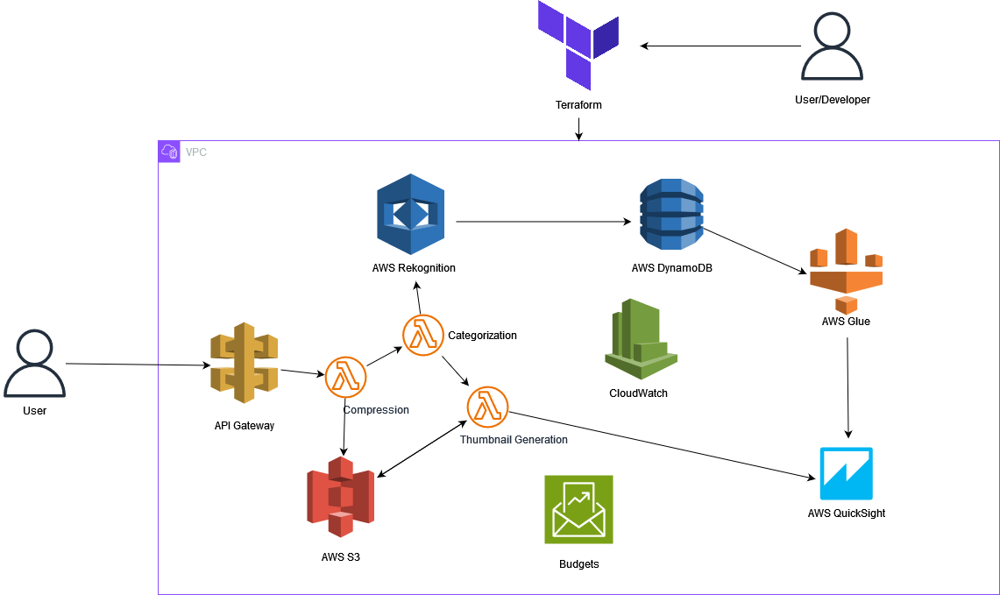

# AWS Image Management Tool
This project is an in-progress conceptual idea designed around the storage, compression, categorization, and retrieval of high-resolution images. Additionally, it incorporates features for monitoring costs and analyzing data usage, while staying within the AWS Free Tier. The architecture is defined using Terraform, for the sake of consolidated and easy IaC configuration.

## Features

-Image Upload & Compression: Users can upload high-resolution images, which are automatically compressed to reduce storage footprint.

-Image Categorization: Uploaded images are analyzed and categorized using Amazon Rekognition, allowing for easy organization and searchability.

-Thumbnail Generation: Thumbnails are generated for quick preview and stored alongside the compressed images.

-Data Analytics with AWS QuickSight: Analyze image usage, popular categories, and user activity through dynamic visualizations.

-Metadata Storage: Image metadata, including categories and tags, are stored in DynamoDB for efficient querying and retrieval.

-Cost Monitoring with AWS Budgets: Monitor costs and receive alerts to ensure the project remains within the AWS Free Tier limits.

-Service Monitoring with CloudWatch: Track service performance, set up alarms, and log all operational metrics to maintain a robust and reliable system.

## Architecture

## Services Utilized and Their Integration
1. API Gateway

    Purpose: Serves as the entry point for image upload requests from users.
    Connection & Flow: When a user uploads an image via the front-end UI, the API Gateway routes the request to the Image Compression Lambda function for processing.

2. AWS Lambda

    Image Compression Lambda: Compresses high-resolution images upon upload and stores the compressed version in Amazon S3.
    Image Categorization Lambda: Invokes Amazon Rekognition to categorize images, then stores the resulting metadata in DynamoDB.
    Thumbnail Generation Lambda: Generates a thumbnail version of the image and stores it in Amazon S3.
    Connection & Flow: Each Lambda function is triggered sequentially. The first Lambda function processes the image and triggers the next, ensuring a smooth workflow from upload to storage and categorization.

3. Amazon Rekognition

    Purpose: Automatically categorizes images based on their content (e.g., identifying trees, buildings, animals, etc.).
    Connection & Flow: The Image Categorization Lambda sends the image data to Rekognition. Once categorized, the results are returned to the Lambda function for metadata storage.

4. Amazon S3

    Purpose: Provides scalable storage for both the original high-resolution images and their compressed counterparts, as well as the generated thumbnails.
    Connection & Flow: The Image Compression Lambda stores compressed images in S3, while the Thumbnail Generation Lambda stores thumbnails. S3 also acts as a data source for AWS QuickSight.

5. DynamoDB

    Purpose: Stores metadata for each image, including tags, categories, and other relevant information.
    Connection & Flow: After categorization, the Image Categorization Lambda writes the metadata to DynamoDB, which can then be queried to retrieve images by category.

6. AWS Glue

    Purpose: Prepares and cleanses the data from DynamoDB and S3 for analysis in AWS QuickSight.
    Connection & Flow: DynamoDB and S3 data is fed into Glue, which processes the data and makes it available for visualization in QuickSight.

7. AWS QuickSight

    Purpose: Visualizes data related to image usage, popular categories, and user activity.
    Connection & Flow: Consumes data prepared by AWS Glue, allowing for dynamic dashboards and reports that provide insights into the system’s performance and user behavior.

8. AWS Budgets

    Purpose: Monitors and controls the project's costs, ensuring it remains within the AWS Free Tier limits.
    Connection & Flow: Integrates with all AWS services used in the project to track spending and set up alerts if costs approach defined thresholds.

9. CloudWatch

    Purpose: Monitors the performance and health of all AWS services involved in the project.
    Connection & Flow: Collects logs and metrics from Lambda functions, API Gateway, and other services, providing real-time monitoring and automated alerts for any operational issues.

10. Terraform

    Purpose: Manages the infrastructure for all the AWS services used in the project, ensuring that the entire architecture is defined and deployed using Infrastructure as Code.
    Connection & Flow: Orchestrates the deployment of API Gateway, Lambda functions, S3 buckets, DynamoDB tables, and other services, ensuring consistency and repeatability across environments.

